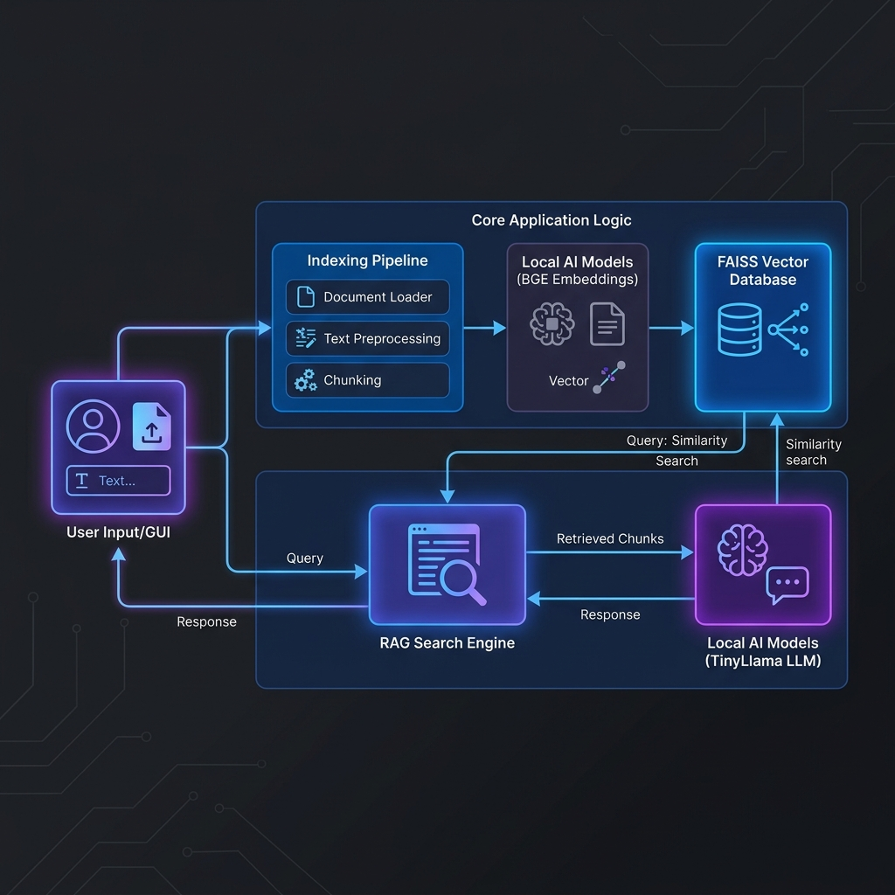

# 🧠 Offline-AI-File-Assistant: Deep Dive Documentation

This document provides a technical yet simple explanation of the entire project, including every file, function, and the AI models that power it.

---

## 🗺️ System Architecture

Below is the visual representation of how the project works.

### 🧩 Relationship Map (The Links)
*   **GUI ◀──▶ RAG Engine:** Sends your question, receives the AI's answer.
*   **RAG Engine ◀──▶ FAISS DB:** Sends a search request, receives matching file chunks. (Two-way communication).
*   **RAG Engine ──▶ TinyLlama:** Sends the chunks + your question for final processing.
*   **TinyLlama ──▶ RAG Engine:** Sends the final natural language answer back.

---

## 🤖 The AI Models: Why these and not others?

We selected these models to balance **Speed**, **Accuracy**, and **Privacy**.

| Model Name | Task | Why we chose it? | Why not others? |
| :--- | :--- | :--- | :--- |
| **BGE-Base-1.5** | Embeddings | Top-tier retrieval accuracy for its size. | Better than older models like BERT or Ada (which requires internet). |
| **Salesforce BLIP** | Image Vision | Generates human-readable descriptions for photos. | Better than CLIP because it explains *what* is in the image, not just a math code. |
| **BART-Large-CNN** | Summarizer | Gold standard for short, professional summaries. | More reliable for factual summaries than smaller T5 models. |
| **TinyLlama-1.1B** | Chat Brain | Extremely fast and fits on almost any computer (even laptops). | Llama-3 or GPT-4 are too big/heavy for offline home use. |

---

## 💾 Why FAISS and not ChromaDB?

This is a common technical question. Here is the simple reason:

1.  **Pure Speed:** FAISS (built by Meta) is the fastest library in the world for searching through millions of vectors. 
2.  **No Background Services:** ChromaDB often needs a background process or server to run. FAISS is a "library"—it's just a file on your disk. This makes your app **portable and lightweight**.
3.  **Low RAM Usage:** FAISS is much more efficient at managing memory for local, personal file searches.

---

## 📁 File-by-File & Function Breakdown

### 📍 Root
*   **`main.py`**
    *   `run_menu()`: The "Grand Central Station". It parses your command-line input and starts the mode you selected (Index, Chat, etc.).

### 📍 Indexing System (`app/indexing/`)
*   **`builder.py`**
    *   `build_index()`: The main pipeline. It walks through every folder, extracts text, chunks it, summarizes it, and saves it to the database.
*   **`delta.py`** (The "Incremental Updater")
    *   `_index_path()`: Re-indexes a single file if it's new or modified.
    *   `_remove_path()`: Cleans up the database if a file is deleted.
*   **`watcher.py`** (The "Background Guard")
    *   `LiveWatcher.start()`: Spawns a background thread to monitor folders while you chat.
    *   `_catch_up_scan()`: Checks for any changes that happened while the program was closed.

### 📍 RAG & AI Brain (`app/rag/`)
*   **`llm.py`**
    *   `init_llm()`: Connects to Ollama to wake up the TinyLlama model.
    *   `_safe_llm_call()`: Sends a message to the AI and handles any errors.
*   **`answer.py`**
    *   `generate_answer_with_llm()`: This is the "Prompt Engineer". It takes the files found in search and builds a perfect prompt for the AI to answer.

### 📍 User Interface (`app/chat/`)
*   **`gui.py`**
    *   `send_query()`: Triggered when you hit Enter. It searches the database and displays the AI's answer.
    *   `open_duplicates_window()`: Opens the cleanup tool.
*   **`cli.py`**
    *   `chat()`: A simple terminal-based chat interface.

---

## ❓ FAQ: Frequently Asked Questions

**Q: Does this app need internet?**
A: **No.** Once the models are downloaded the first time, it works 100% offline.

**Q: Is my data safe?**
A: **Yes.** Your files never leave your computer. The AI "reads" them locally.

**Q: Why is the first index slow?**
A: Because the AI has to read every single word and "caption" every image. Future updates are much faster thanks to the `watcher.py`.

**Q: Can I search for images?**
A: **Yes.** You can type "Show me photos of the beach," and it will find images based on the AI-generated captions.

**Q: What happens if I delete a file?**
A: The `LiveWatcher` detects the deletion and automatically removes that file's info from the search database.

**Q: How many files can it handle?**
A: It can easily handle 5,000 to 10,000 documents on a standard laptop.
